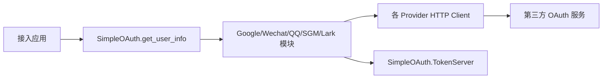

# elixir_simple_oauth - 系统概览

## 1. 系统定位
`elixir_simple_oauth` 是多平台 OAuth 登录库，统一封装 Google/Wechat/QQ/SGM/Lark 的用户信息获取流程。

扫描数据：
- Elixir 文件约 29 个
- 无 Router/Repo
- 启动子进程：`TokenServer` + `HLClock`

## 2. 责任边界
- 负责：provider 级 OAuth token/用户信息交换、token 缓存。
- 不负责：应用侧会话管理与用户持久化。

## 3. 总览架构图

